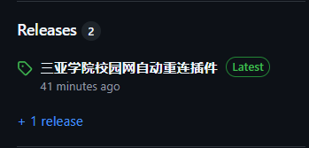

# 三亚学院校园网自动重连登录插件

最近打游戏时总是校园网突然掉线啊，干脆直接写了个app常驻后台自动打开登录页面

会根据联网状态切换图标显示；断网自动打开校园网登录网页

本质就是很简单的检测网络状态，自动打开网页，设置检测时间为 2 秒

## 使用说明

以下教程写给纯小白的 XD 平时玩 Github 的应该已经轻车熟路的用上了吧

### 下载安装

1. 点击进入 Releases 的 **三亚学院校园网自动重连插件**

    

2. 根据文件说明在下方选择你要的版本，推荐第一个

    

 - USYNetAutoLoginSetup_1.0.1.msi 版本

    下载完成后，双击进行安装

 - USYNetAutoLogin_1.0.1.zip 版本

    下载完成后，解压直接双击 USYNetAutoLogin.exe 运行

4. 安装完成后将会在 桌面 和 开始菜单 建立图标

    

### 软件说明

1. **启动后将不会有窗口弹出，在 隐藏任务栏中**

    

2. 无网络连接：图标变成灰色

    有网络连接时 ：图标颜色正常

3. 检测到网络断开连接会自动打开校园网网页

4. 退出：直接右键点击退出

## USYNetAutoLogin_1.0.1.zip 版本的特殊功能

解压后文件应该如图所示

- icon_connected.ico: 网络正常时图标，可替换
- icon_disconnected.ico: 网络失去连接时图标，可替换
- config.txt: 设置检测间隔时间，单位为 ms
    
    如 时间间隔=2000 为 2s 检测一次，最低时间建议 500 以上

    设置成功可在插件右键菜单中显示当前设置的间隔长度

    修改完成后，需重启插件才能生效哟

## 关于

### 此项目属于 [Alyvesy](https://github.com/Alyvesy)

### 此项目使用协议：BY-NC-ND 4.0 ，包含了以下条款：

署名（Attribution）：您必须给予原作者适当的署名，提供指向许可证的链接，并说明是否对作品进行了修改。您可以以合理的方式进行署名，但不能暗示作者支持您或您使用该作品的方式。

非商业性使用（NonCommercial）：您可以复制和分发作品，但只能用于非商业目的。这意味着您不能以任何商业方式使用该作品。

禁止演绎（NoDerivatives）：您不能修改、转换或以其他方式构建在该作品之上。您只能以原始形式分发该作品。

保留权利：除了在许可证中明确规定的权利外，所有其他权利均保留给原作者。这意味着未获得作者许可的使用仍然是受限的。

适用法律：许可证在适用法律的范围内有效，且不影响原作者根据法律享有的其他权利。

许可证的有效性：若某人违反许可证条款，许可证将自动终止，但如果该人随后停止违规行为并满足许可证的所有条款，则许可证将恢复有效。

### 其他

为了安全性原因才使用的 BY-NC-ND 4.0 协议

后续将制作通用型 app 并新开个 repo，并将遵守 GPLv3 协议